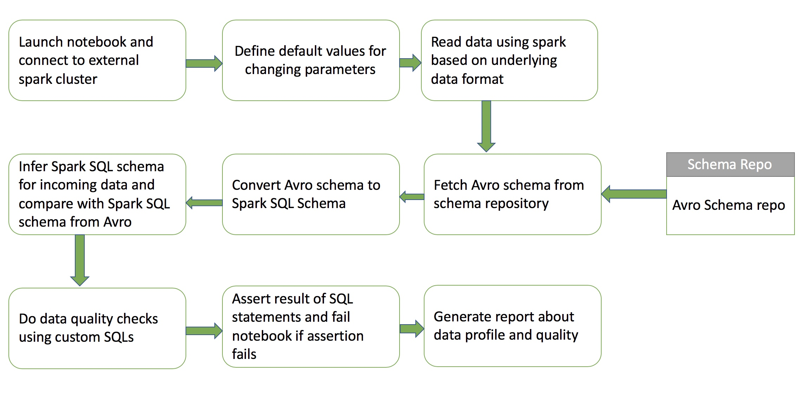

## What's the purpose of this documentation ?

This document walks through how the profiler profiles the data.

### Whats expected from the end user ?

End user is expected to pass in the following information: 

```bash
"dataFormat":"dataformat"
"inputDataLocation":"s3 or hdfs location of data"
"appName":"Meaningful name to this application"
"schemaRepoUrl":"host name of schema repository"
"scheRepoSubjectName":"name of the subject for which data is being validated"
"schemaVersionId":"numerical version of the schema"
"customQ1":"custom sql, make sure that this returns Long value"
"customQ1ResultThreshold": 0
"customQ1Operator":" = | > | < | <= | >= ",
"customQ2":"custom sql, make sure that this returns Long value",
"customQ2ResultThreshold": 0,
"customQ2Operator":" = | > | < | <= | >= ",
"customQ3":"custom sql, make sure that this returns Long value",
"customQ3ResultThreshold": 0,
"customQ3Operator":" = | > | < | <= | >= "
```

Take a look at [this](https://github.com/Nordstrom/bigdata-profiler#run-instructions) for a live example

### What does the profiler exactly do ?



* First we launch the jupyter notebook which is scala based.
* We configure the notebook to submit a spark job to an external spark cluster. This is where we set details like number of cores required, memory and some dependencies like `spark-avro` and `datadog-statsd` client. You should be able to use any `spark-submit` configuration here. 
* Next we define default values for changing parameters. These values will be updated by `papermill` everytime the notebook is run based on what parameters are passed in using the `papermill` script. 
* Now we will initialize the `datadog` statsd client and forward metrics to local statsd port. 
* We will now read the data that needs to be profiled in using apache spark. We will select options based on what the data format is.
* Once we have read the data in as a `dataframe` we will report some basic stats around the dataframe to `datadog`.
* Now we will query the `schema repository` and fetch the registered schema. Schema is defined using `Avro` formar. 
* This `Avro` schema will be converted to `spark sql` schema. 
* We will be infering the `spark sql` schema from the incoming data and then `comparing` the registered schema with the inferred schema from the data.
* We will publish amount of matches and mis-matches to datadog. 
* Next, we are going to perform `custom data quality` checks based on `sql` statements fired on the dataset. 
* We will assert that the result of the `sql` statements meet the thresholds set. 